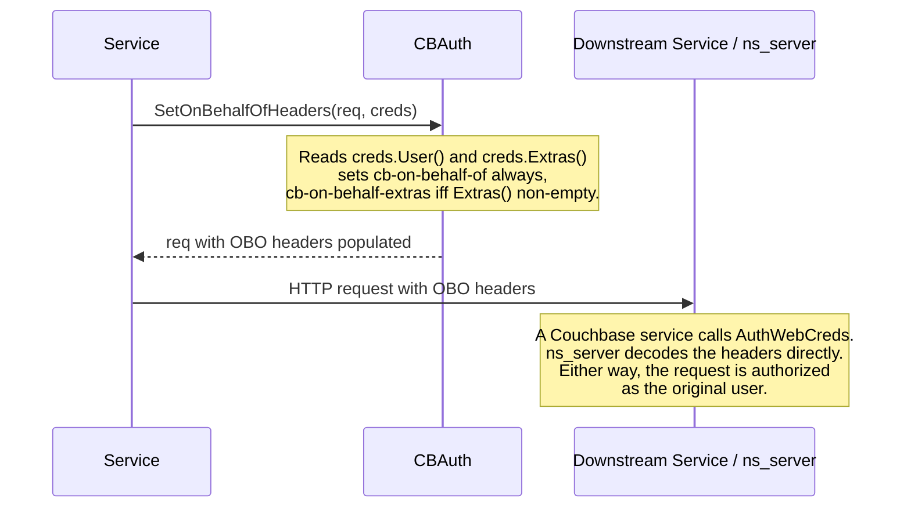

# Sending cb-on-behalf-of Requests

When a Couchbase service receives an authenticated request from a user and
then needs to make an HTTP call to another Couchbase service *on that user's
behalf*, it must forward the user's identity so the downstream service
authorizes against the original user — not against the calling service's own
credentials.

This is done with two headers:

| Header                 | Value                                    | Required                          |
| ---------------------- | ---------------------------------------- | --------------------------------- |
| `cb-on-behalf-of`      | base64(`user:domain`)                    | Always                            |
| `cb-on-behalf-extras`  | base64(raw extras string from `Extras()`) | Only if `Extras()` is non-empty  |

Both values are base64-encoded on the wire. `cbauth` decodes them
automatically on the receiving side (see `AuthWebCredsCore` in
[`cbauth.go`](../cbauth.go)).

## Why both headers matter

`cb-on-behalf-of` alone is not sufficient. For users authenticated via JWT or
SAML, `Creds.Extras()` carries authentication context that ns_server/cbauth
needs to authorize the downstream call correctly — session id, token expiry,
additional roles/groups granted by the IdP, etc. Dropping extras means the
downstream service may make an authorization decision that diverges from what
ns_server would have made for the original request.

Two anti-patterns to avoid:

1. **Sending only `cb-on-behalf-of`.** Works for local users, silently breaks
   authorization for JWT/SAML users once their extras carry expiry or
   IdP-granted roles.
2. **Re-authenticating as the service itself** (e.g., using the service's
   admin credentials for the downstream call). This completely loses the
   original user's identity — audit logs, permission checks, and bucket
   access all resolve against the service account instead of the real user.

Services should not inspect or parse the extras string. Its format is an
implementation detail shared between ns_server and cbauth.

## Creating an on-behalf-of request

After authenticating the inbound request with `AuthWebCreds`, use
`cbauth.SetOnBehalfOfHeaders` to populate both headers on the outbound
request from the resulting `Creds`:

```go
cbauth.SetRequestAuth(req)             // service's own transport creds
cbauth.SetOnBehalfOfHeaders(req, creds) // OBO headers layered on top
```

`SetOnBehalfOfHeaders` handles both headers atomically: it always sets
`cb-on-behalf-of`, and it sets `cb-on-behalf-extras` iff `creds.Extras()`
is non-empty. Prefer this helper over hand-rolling the two `Header.Set`
calls — it guarantees that the extras header is not silently dropped for
JWT/SAML users, whose authorization context lives in `Extras()`.

Passing a nil `Creds` is a no-op. This lets a shared outbound
request-builder call `SetOnBehalfOfHeaders` unconditionally and let the
nil check short-circuit the non-OBO paths (e.g. a service acting under
its own identity rather than on behalf of a user).

If for some reason you need to construct the headers manually (e.g. from a
non-`net/http` request type), replicate the same contract: base64-encode
`user:domain` into `cb-on-behalf-of`, and base64-encode the raw extras
string into `cb-on-behalf-extras` when non-empty. Use `creds.User()`
(returns `name, domain`).

The downstream target may be either another Couchbase service (which
re-authenticates via `AuthWebCreds`) or ns_server itself (which decodes the
headers directly). The caller's responsibility is the same in both cases:
build and attach the two headers.



## Forwarding a request

If the service is a proxy/forwarder and the inbound request already carries
`cb-on-behalf-of` and/or `cb-on-behalf-extras`, preserve those headers
verbatim. They are already base64-encoded — do **not** decode and re-encode,
and do **not** replace them with a fresh pair built from the service's own
credentials.
